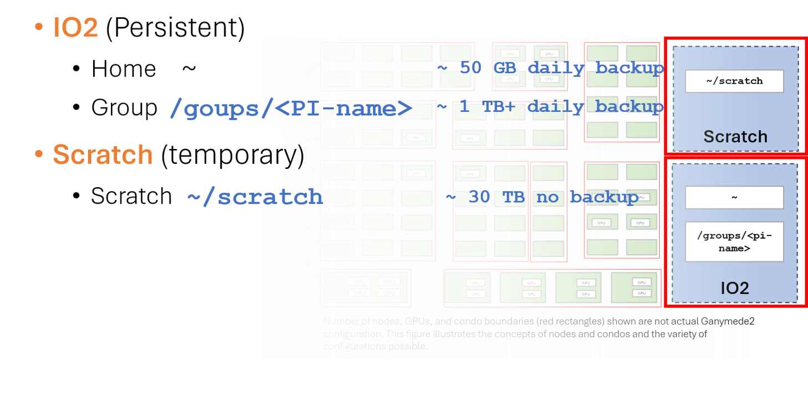

# Storage and Data Transfer

## Overview

Understanding where to store your data and how to move it efficiently is essential for effective HPC usage. G2 provides two storage tiers:

- **IO2**: High-speed storage for programs and data in active use. Includes Home and Group directories.
- **Scratch**: Very high-performance storage optimized for I/O-intensive batch jobs. Up to **10× faster** than IO2 for large I/O.



## Storage Systems on G2

### Home Directory

**Path**: `~` (i.e., `/home/netID`)

**Purpose**: Configuration files, login scripts, user-installed software, batch job scripts, small input and output files

**Characteristics**:

- ✓ Backed up daily
- ✓ Persistent (data retained indefinitely)
- ✓ Private to your account
- ✗ Quota: 50 GB
- ✗ Not recommended for batch job I/O

**Check your usage**:
```bash
mfsgetquota -H ~
```

Example output:
```
/home/netID:
soft quota grace period: 1w (default)
          |  curr |  soft | percent |  hard | percent |
 inodes   |   50k |  300k |   16.67 |  320k |   15.63 |
 length   |  30GB |     - |       - |     - |       - |
 size     |  33GB |  50GB |   66.00 |  55GB |   60.00 |
 realsize | 100GB |     - |       - |     - |       - |
```

`size` is the quota-enforced limit. `realsize` is the actual disk space consumed after IO2's 3× replication.

### Group Directory

**Path**: `/groups/<pi-name>`

**Purpose**: Shared data, software, models, and results for a research group

**Characteristics**:

- ✓ Shared among all members of the research group
- ✓ Backed up daily
- ✓ Persistent storage
- ✓ Can be used for batch jobs with light to moderate I/O
- ✓ Quota: 1 TB (normal users), up to 20 TB (condo owners)
- ✗ Requires PI to have a group directory set up

**Best for**:

- Group software installations (e.g., shared Conda environments)
- Large shared datasets
- Collaborative results and model files

**Check your group usage**:
```bash
mfsgetquota -H /groups/<pi-name>
```

!!! tip
    Conda environments installed in `/groups/<pi-name>` can be shared with all group members. This is the recommended approach for group-wide software.

### Scratch Space

**Path**: `~/scratch`

**Purpose**: High-speed temporary storage for I/O during batch jobs

**Characteristics**:

- ✓ Quota: 30 TB (soft limit)
- ✓ Up to 10× faster than Home/Group for large I/O
- ✓ Private to your account
- ✗ **Never backed up**
- ✗ Purged regularly — old files are deleted automatically
- ✗ Do not use for long-term storage

**Best for**:

- Large input and output files during active jobs
- Intermediate computation results

See [Scratch Space Guide](scratch-space.md) for policies and usage patterns.

## Storage Selection Guide

| Data Type | Recommended Location |
|-----------|---------------------|
| Config files, `.bashrc` | Home (`~`) |
| Source code and job scripts | Home (`~`) |
| Small datasets (<1 GB) | Home (`~`) |
| Shared group software (Conda environments) | Group (`/groups/<pi-name>`) |
| Large shared datasets | Group (`/groups/<pi-name>`) |
| Job I/O during execution | Scratch (`~/scratch`) |
| Long-term results | Group (`/groups/<pi-name>`) |

## Checking Quotas

```bash
# Home directory
mfsgetquota -H ~

# Group directory
mfsgetquota -H /groups/<pi-name>

# Scratch usage (no formal quota display)
du -sh ~/scratch
```

Two types of quotas are enforced:
- **Size quota**: Total bytes stored
- **Inode quota**: Total number of files and directories

## Data Transfer Methods

### SCP (Secure Copy)

**Upload to G2**:
```bash
# Single file
scp myfile.txt netID@ganymede2.utdallas.edu:~/work

# Directory
scp -r mydir/ netID@ganymede2.utdallas.edu:~/scratch/
```

**Download from G2**:
```bash
# Single file
scp netID@ganymede2.utdallas.edu:~/scratch/results.txt ./

# Directory
scp -r netID@ganymede2.utdallas.edu:~/scratch/output/ ./
```

### Rsync (Recommended for Large Transfers)

`rsync` is more robust than `scp` for large or interrupted transfers — it resumes where it left off.

**Upload to G2**:
```bash
rsync -avzP mydata/ netID@ganymede2.utdallas.edu:~/scratch/mydata/
```

**Download from G2**:
```bash
rsync -avzP netID@ganymede2.utdallas.edu:~/scratch/results/ ./results/
```

**Useful rsync options**:

| Option | Description |
|--------|-------------|
| `-a` | Archive mode: preserves permissions and timestamps |
| `-v` | Verbose output |
| `-z` | Compress during transfer |
| `-P` | Show progress; resume interrupted transfers |
| `--exclude` | Skip specific files or patterns |

### GUI File Transfer

**FileZilla** (cross-platform), **WinSCP** (Windows), and **Cyberduck** (Mac/Windows) all work with G2 via SFTP:

- **Host**: `ganymede2.utdallas.edu`
- **Protocol**: SFTP
- **Port**: 22
- **Username**: your UTD NetID
- **Password**: your UTD NetID password

### Open OnDemand File Manager

The [G2 Open OnDemand portal](https://g2-ood.circ.utdallas.edu/) provides a browser-based file manager where you can upload and download files without needing a separate client.

## Data Compression

Compress files before long-distance transfers or archiving:

```bash
# gzip (fast, good ratio for text)
gzip largefile.txt           # Creates largefile.txt.gz
gunzip largefile.txt.gz      # Restore

# Compress a directory as a tar archive
tar czf archive.tar.gz directory/
tar xzf archive.tar.gz       # Extract
```

## Data Management Best Practices

### Scratch Workflow

For any job with heavy I/O:

1. **Copy data in** at the start of the job
2. **Read from and write to** Scratch during the job
3. **Copy data out** at the end of the job
4. **Clean up** scratch space after the job

See [Scratch Space Guide](scratch-space.md) for a complete batch script example.

### Regular Cleanup

Find and remove old files to avoid filling up your storage:

```bash
# Files not accessed in 30 days
find ~/scratch -atime +30 -type f

# Files larger than 1 GB
find ~/scratch -size +1G

# Delete old temporary files
find ~/scratch -name "*.tmp" -mtime +7 -delete
```

### Backup Important Data

HPC storage is not a permanent backup solution. Regularly copy important results to:

- Your personal computer
- External hard drive
- UT Dallas cloud storage (Box)
- Research data repositories

## Troubleshooting

### Quota Exceeded

```bash
# Check what is using space
du -sh /home/$USER/* | sort -h
du -sh /groups/<pi-name>/* | sort -h

# Find large files
find ~ -size +500M -ls
```

### Transfer Interrupted

Use `rsync` with `-P` — it will automatically resume from where it stopped:
```bash
rsync -avzP source/ netID@ganymede2.utdallas.edu:destination/
```

### Permission Denied

```bash
# Check ownership and permissions
ls -l filename

# Fix permissions on your own files
chmod 644 filename
chmod 755 directory/
```

## Quick Reference

```bash
# Check quotas
mfsgetquota -H ~
mfsgetquota -H /groups/<pi-name>

# Transfer files
scp file.txt netID@ganymede2.utdallas.edu:~/scratch
rsync -avzP directory/ netID@ganymede2.utdallas.edu:~/scratch/directory/

# Compress
tar czf archive.tar.gz directory/
tar xzf archive.tar.gz
```

| Location | Path | Quota | Backup | Use For |
|----------|------|-------|--------|---------|
| Home | `~` | 50 GB | Yes (daily) | Config, scripts, small data |
| Group | `/groups/<pi-name>` | 1–20 TB | Yes (daily) | Shared software, datasets, results |
| Scratch | `~/scratch` | 30 TB | Never | High-speed I/O during batch jobs |

## Next Steps

- [Scratch Space policies and usage →](scratch-space.md)
- [Submit your first job →](../running-programs/slurm.md)

## Need Help?

- **Data transfer issues**: [circ-assist@utdallas.edu](mailto:circ-assist@utdallas.edu)
- **Quota requests**: Open a ticket at the HPC Services page
